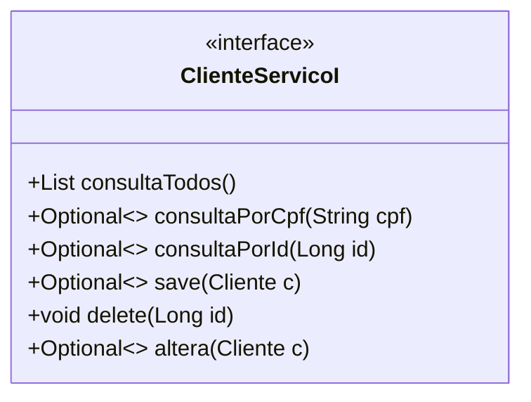
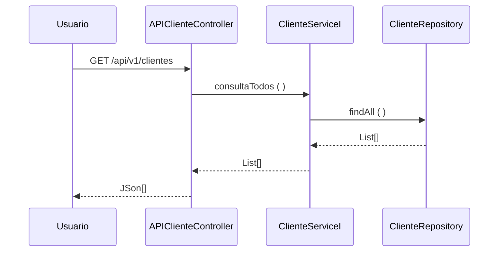

### Fatec ZL - Centro Paula Souza 
##### Disciplina - Programação Web III
##### Projeto Interdisciplinar - SOCIELOO
Grupo CPdev 
- <a href="https://github.com/ademiralves">Ademir Martins</a>
- <a href="https://github.com/Aryel15">Aryel Anne</a>
- <a href="https://github.com/BiaJL">Bianca Jesus</a>
- <a href="https://github.com/DiogoLCarvalho">Diogo Carvalho</a>
- <a href="https://github.com/FernandaSena07">Fernanda Sena</a>
- <a href="https://github.com/leocaje">Leonardo Cajé</a>
##### Processo de Desenvolvimento de Software - PDS
> O PDS segue uma abordagem interativa incremental adaptada do Scrum. Cada interação tem uma definição de pronto estabelecida com objetivo de controlar a qualidade. 
##### Estudo de Caso – SOCIELOO
> No contexto do projeto interdisciplinar o estudo de caso tem como objetivo desenvolver e implantar um site centralizador de ONGs, instituições e projetos sociais da cidade de São Paulo, com o propósito de divulgá-las a possíveis doadores e voluntários e criar, assim, um ELO entre ONGs e a sociedade. O diferencial do site é a maior flexibilidade do usuário para a escolha de Projetos sociais com a localização e segmento de sua preferência, podendo favoritar, analisar e avaliar cada projeto.
##### Product Backlog 
- RU01 - Compras - Registra e acompanha os processos de compras na organização, prevê a entrega programada de pedidos de compra 
- RU02 - Recebimento - Registra, controla e informa sobre a entrada de mercadorias e integra as informações dos dados da nota fiscal de entrada com o estoque 
- RU03 - Vendas – Registra e acompanha as vendas mantendo as informações integradas com o controle de estoque. 
##### Sprint Backlog 
> Cada requisito tem um identificador único de maneira que seja possível rastrear a necessidade do cliente com a implementação do software. 

| Identificador | Descrição | Prioridade | 
| ------------ | ------------------------------------------------------------------------ | ------| 
| REQ01 – Cadastrar ONGs/Instituições/Projetos Sociais | **Como** – ONG/Instituição/Projeto Social;  **Eu quero** – Cadastrar no site a ação social no site;  **De maneira que** – Seja possível criar um perfil próprio para o projeto (Página de ONG). | Alta | 
| REQ02 – Consultar ONGs/Instituições/Projetos Sociais | **Como** – Usuário;  **Eu quero** – Consultar uma ONG´s/Instituições/Projetos Sociais;  **De maneira que** – Seja possível obter informações sobre a ONG´s/Instituições/Projetos Sociais como descrição textual, sua história, imagens, informações de contato e de doação e mapa de localização. | Alta | 
| REQ03 – Atualizar ONGs/Instituições/Projetos Sociais | **Como** – ONG´s/Instituições/Projetos Sociais;  **Eu quero** – Alterar os dados da ONG/Instituição/Projeto Social;  **De maneira que** – Seja possível atualizar informações de ONG/Instituição/Projeto Social, nos casos de mudanças de endereço, informações de contato, imagens e localização. | Média | 
| REQ04 – Excluir ONGs/Instituições/Projetos Sociais | **Como** – ONG/Instituição/Projeto Social OU Moderador/Administrador;  **Eu quero** (se ONG/Instituição/Projeto Social) – Excluir meu cadastro e minha Página de ONG do site;  **De maneira que** – Meus dados não sejam mais divulgados pelo site.  **Eu quero** (se Moderador/Administrador) – Excluir o cadastro de uma ONG e sua Página de ONG do site;  **De maneira que** – As informações publicadas por aquele projeto não estivessem mais disponíveis no site. | Média |  
| REQ05 – Cadastrar Usuário | **Como** – Usuário;  **Eu quero** – Fazer um cadastro de usuário no site;  **De maneira que** – Seja possível criar um perfil próprio para favoritar ONG’s por segmento e região, avaliar ONG’s e preencher formulários de ONG’s. | Alta | 
| REQ06 – Consultar Usuário | **Como** – ONG/Instituição/Projeto Social OU Moderador/Administrador;  **Eu quero** – Consultar o perfil de um usuário;  **De maneira que** – Seja possível obter informações sobre o usuário e bloquear ou excluir o seu perfil, se necessário. | Baixa |
| REQ07 – Atualizar Usuário | **Como** – Usuário;  **Eu quero** – Alterar seus dados de Usuário;  **De maneira que** – Seja possível atualizar informações de usuário. | Média |
| REQ08 – Excluir Usuário | **Como** – Usuário OU Moderador/Administrador;  **Eu quero** (se Usuário) – Excluir meu cadastro e meu perfil de usuário;  **De maneira que** – Meus dados não sejam mais divulgados pelo site.  **Eu quero** (se Moderador/Administrador) – Excluir o cadastro de um usuário do site;  **De maneira que** – As informações daquele usuário não estiverem mais disponíveis no site. | Média |
| REQ09 – Login de ONGs e usuários | **Como** – Usuário;  **Eu quero** – Fazer doações, pesquisar ações sociais, avaliar e comentar;  **De maneira que** – Possa consultar e atualizar o perfil de usuário. | Alta |
| REQ10 – Fazer Avalições | **Como** – Usuário;  **Eu quero** – Escrever comentários;  **De maneira que** – Seja possível criar comentários em perfis de ONGs. | Média |
| REQ11 – Excluir Avaliações | **Como** – Moderador;  **Eu quero** – Excluir comentários;  **De maneira que** – Possa retirar comentários ofensivos e ou de conteúdo impróprio. | Média |
##### Definição de pronto 
> O sprint será considerado concluido quando: 
> 1) Os casos de teste de aceitação forem executados e obtiverem 100% de satisfatorios. Os casos de teste (CT) são rastreáveis para os requisiitos (REQ). O elo de rastreabilidade 
é estabelecido pelo identificador do caso de teste.
> 2) Depois de executado os casos de teste com 100% de satisfatorios o código deve ser armazenado no github (commit). 
##### Casos de teste 
| Identificador | Cenário de uso | 
| ------------ | ------------------------------------------------------------------------ | 
| REQ01CT01 | **Dado que** – A ONG/Instituição/Projeto social não está cadastrada;  **Quando**   – O usuário solicitar cadastro de ação social;  **Então** – O sistema envia os dados cadastrais para a aprovação do moderador. Se as informações estiverem completas e os dados checarem, é enviada uma mensagem para a ONG indicando que o cadastro foi concluído com sucesso e a ONG recebe uma Página de ONG publicada no site.  |
| REQ01CT02 | **Dado que** – A ONG/Instituição/Projeto social não está cadastrada;  **Quando**   – O usuário solicitar cadastro de ação social;   **Então** – O sistema envia os dados de cadastro para a aprovação do moderador. Se houver informações faltando e/ou incongruentes, o moderador veta o cadastro e a publicação da Página de ONG. É enviada uma mensagem, para a ONG, informando quais dados faltam e/ou apresentam incongruências e solicitando sua correção, para posterior avaliação. |
| REQ02CT01 | **Dado que** – A ONG/Instituição/Projeto Social CNPJ 62.823.257/0001-09 está cadastrado; **Quando**   - o usuário solicitar uma consulta pelo CNPJ; **Então** – o sistema apresenta os detalhes da ONG´s/Instituições/Projetos Sociais cadastrado|
| REQ03CT01 | **Dado que** – A ONG/Instituição/Projeto Social;  **Quando**   – Quer alterar seus dados de ONG/Instituição/Projeto Social;  **Então** – O sistema envia uma mensagem para a ONG/Instituição/Projeto Social comunicando que os dados foram atualizados|
| REQ03CT02  | **Dado que** – A ONG/Instituição/Projeto Social; **Quando**   – Quer alterar seus dados de ONG/Instituição/Projeto Social; **Então** – O sistema envia uma mensagem para a ONG/Instituição/Projeto Social comunicando que houve uma falha na tentativa de atualizar os dados cadastrais |
| REQ04CT01  | **Dado que** – A ONG foi excluída do site; **Quando**   (ONG/Instituição/Projeto Social) – tiver solicitado a remoção de cadastro; **Então** – A ONG é informada, via mensagem pop-up, de que seu cadastro foi excluído com sucesso; **Quando**   (Moderador/Administrador) – tiver optado por remover o cadastro de uma ONG; **Então** – A ONG recebe uma notificação, via e-mail, de que seu cadastro foi removido do site, informando o devido motivo da exclusão  |
| REQ05CT01 | **Dado que** – O usuário não está cadastrado; **Quando**   – O usuário solicitar o cadastro de doador;  **Então** – O sistema envia uma mensagem de cadastro concluído com sucesso |
| REQ05CT02 | **Dado que** – O usuário não está cadastrado; **Quando**   – O usuário cadastrar o e-mail com o código de validação errado;  **Então** - O sistema não validará o cadastro e mostrará uma mensagem de erro |
| REQ06CT01 | **Dado que** – O usuário de nome João Pedro de Souza está cadastrado; **Quando**   - o usuário solicitar uma consulta pelo NOME;  **Então** – o sistema apresenta os detalhes do usuário cadastrado  |
| REQ07CT01 | **Dado que** – O usuário;  **Quando**   – Quer alterar seus dados de Usuário;  **Então** – O sistema envia uma mensagem para o usuário comunicando que os dados foram atualizados.|
| REQ07CT02 | **Dado que** – O usuário;   **Quando**   – Quer alterar seus dados de Usuario;  **Então** – O sistema envia uma mensagem para o usuário comunicando que houve uma falha na tentativa de atualizar os dados cadastrais|
| REQ08CT01 | **Dado que** – O usuário foi excluído do site;  **Quando**   (ONG/Instituição/Projeto Social) – tiver solicitado a remoção de cadastro; **Então** – O usuário recebe uma notificação, via e-mail, de que seu cadastro foi removido do site. |
| REQ13CT01| **Dado que** – o usuário está cadastrado;  **Quando**  - Inserir a opção de “Esqueci a senha”;  **Então**- Sistema envia um link para redefinição de senha no e-mail cadastrado|
| REQ14CT01 | **Dado que** – o usuário não esteja logado;  **Quando**   – For escrever um comentário;  **Então** - O sistema irá pedir para que faça o login ou cadastre uma conta para comentar. | 
> 
O modelo de dominio (Larman, 2006 - classes conceituais ou classes de negócio) foi definido considerando as seguintes classes: 

A arquitetura segue uma abordagem orientada a serviços. Os serviços foram classificados em três tipos (ERL, 2007): 
- **1. Serviços utilitários**. Implementam funcionalidades comuns a vários tipos de aplicações, como, por exemplo: log, notificação, transformação de informações. Um exemplo de serviço utilitário é um serviço de conversão de moeda que 
poderá ser acessado para calcular a conversão de uma moeda (por exemplo, dólares) para outra (por exemplo, euros). 
- **2. Serviços de entidade (serviços de negócios)**. Derivado de uma ou mais entidades de negócio (domínio), possuindo um alto grau de reutilização. Geralmente são serviços que fazem operações CRUD (Create, Read, Update e Delete). 
- **3. Serviços de tarefa (coordenação de processos-workflow)**. Tipo de serviço mais específico que possui baixo grau de reuso. Consome outros serviços para atender seus consumidores. São serviços que suportam um processo de negócios 
amplo que geralmente envolve atividades e atores diferentes. Um exemplo de serviço de coordenação em uma empresa é um serviço de pedidos em que os pedidos são feitos, os produtos são aceitos e os pagamentos são efetuados. 
A visão lógica da arquitetura para API de Cliente é apresentada na figura abaixo. A visã lógica descreve como o código está organizado, as classes os pacotes e os relacionamentos entre eles. 
 
>A entidade Cliente foi identificada como um serviço (ERL, 2007 - serviço do tipo entidade) o contrado das operações de sistema (LARMAN, 2006, pag.140) foram definidas no diagrama abaixo. 

>O diagrama de sequência descreve como os varios componentes arquiteturais colaboram para manipular uma operação de sistema (exemplo para operação consultaTodos()) 

>Referencias 
- [1] KRUCHTEN, Philippe. Reference: Title: Architectural blueprints—the “4+ 1” view model of software architecture. IEEE software, v. 12, n. 6, 1995. 
- [2] RICHARDSON, Chris. Microservices patterns: with examples in Java. Simon and Schuster, 2018. 
- [3] ERL, Thomas. SOA principles of service design (the Prentice Hall service-oriented computing series from Thomas Erl). Prentice Hall PTR, 2007. 
- [4] LARMAN, Craig. Utilizando UML e padrões. 2aed., Porto Alegre: Bookman Editora, 2006 (pag. 147)
